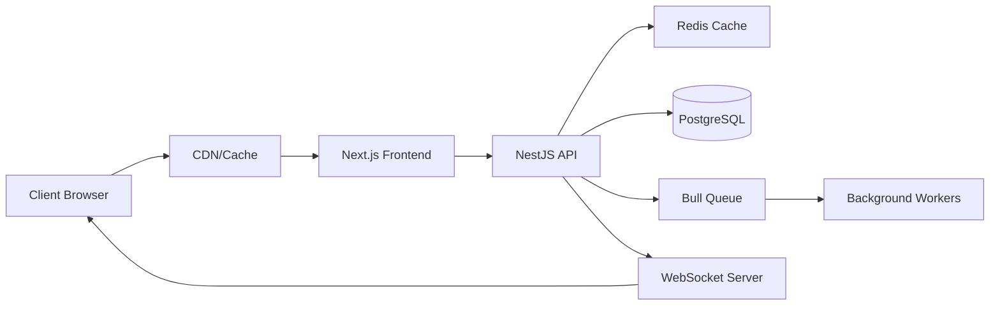

# Architecture - VMCloud Platform

## Vue d'ensemble

VMCloud Platform est une plateforme de location de machines virtuelles construite avec une architecture moderne microservices.

## Stack Technique

### Backend
- **Framework**: NestJS (TypeScript)
- **Database**: PostgreSQL 15
- **ORM**: Prisma
- **Cache**: Redis
- **Queue**: Bull (Redis-based)
- **Authentication**: JWT avec refresh tokens
- **Real-time**: Socket.io
- **API Style**: RESTful + WebSocket

### Frontend
- **Framework**: Next.js 14 (App Router)
- **Styling**: Tailwind CSS + shadcn/ui
- **State Management**: Zustand
- **Data Fetching**: TanStack Query
- **Forms**: React Hook Form + Zod
- **i18n**: next-intl
- **Charts**: Recharts

### DevOps
- **Containerization**: Docker
- **Orchestration**: Kubernetes (production)
- **CI/CD**: GitHub Actions
- **Monitoring**: Prometheus + Grafana
- **Logging**: ELK Stack
- **API Docs**: Swagger/OpenAPI

## Architecture Patterns

### Backend Patterns
- **Modular Monolith**: Modules organisés par domaine métier
- **Repository Pattern**: Abstraction de la couche données
- **Service Layer**: Logique métier isolée
- **DTO Pattern**: Data Transfer Objects pour validation
- **Guards & Interceptors**: Sécurité et transformation des données
- **Event-Driven**: Communication asynchrone entre modules

### Frontend Patterns
- **Component-Based**: Composants réutilisables
- **Atomic Design**: Atoms, Molecules, Organisms
- **Server Components**: Rendu côté serveur
- **API Layer**: Abstraction des appels API
- **Error Boundaries**: Gestion d'erreurs robuste

## Structure des Modules

### API Modules
```
src/modules/
├── auth/           # Authentication & Authorization
├── users/          # User management
├── instances/      # VM instances management
├── billing/        # Billing & Subscriptions
├── products/       # Product catalog
├── monitoring/     # System monitoring
├── support/        # Support tickets
└── admin/          # Admin operations
```

### Flux de Données



## Sécurité

### Authentication Flow
1. Login avec email/password
2. Génération JWT (15min) + Refresh Token (7 jours)
3. Stockage refresh token en HttpOnly cookie
4. Rotation automatique des tokens
5. Blacklist des tokens révoqués

### Authorization
- **RBAC**: Role-Based Access Control
- **Roles**: Admin, Support, Customer
- **Guards**: Protection des routes et endpoints
- **Rate Limiting**: Protection contre les abus
- **CORS**: Configuration stricte
- **Helmet**: Headers de sécurité

## Database Schema

### Core Tables
- `users` - Utilisateurs et authentification
- `products` - Catalogue de produits VM
- `instances` - Instances VM actives
- `subscriptions` - Abonnements
- `transactions` - Historique des paiements
- `support_tickets` - Tickets de support
- `audit_logs` - Journal d'audit
- `settings` - Configuration système

### Relations
- User -> Many Instances
- User -> Many Subscriptions
- Instance -> One Product
- Instance -> One Subscription
- Ticket -> Many Messages
- User -> Many Transactions

## Scalabilité

### Horizontal Scaling
- **API**: Multiple instances derrière un load balancer
- **Database**: Read replicas pour les lectures
- **Cache**: Redis Cluster
- **Queue**: Multiple workers

### Performance
- **CDN**: Assets statiques
- **Caching**: Multi-level (CDN, Redis, Application)
- **Database Indexing**: Indexes optimisés
- **Lazy Loading**: Chargement à la demande
- **Code Splitting**: Bundles optimisés

## Monitoring

### Métriques
- **Application**: Response time, error rate, throughput
- **Infrastructure**: CPU, RAM, Disk, Network
- **Business**: Active users, revenue, churn rate

### Alerting
- **Critical**: Downtime, payment failures
- **Warning**: High latency, disk space
- **Info**: New deployments, maintenance

## Deployment

### Environments
- **Development**: Docker Compose local
- **Staging**: Kubernetes cluster
- **Production**: Kubernetes avec auto-scaling

### CI/CD Pipeline
1. Code push to GitHub
2. Run tests (unit, integration)
3. Build Docker images
4. Push to registry
5. Deploy to staging
6. Run E2E tests
7. Manual approval
8. Deploy to production
9. Health checks
10. Rollback if needed