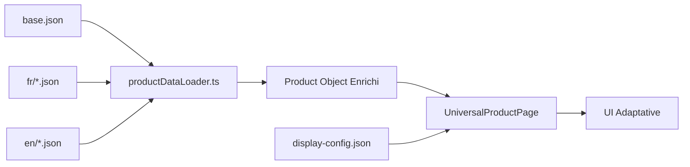

# Architecture des Données Produits 🏗️

## 🎯 Objectif

Créer une architecture de données claire, maintenable et extensible pour gérer tous les produits de la plateforme VMCloud avec support multilingue complet.

## 📁 Structure Clarifiée

```
/apps/web/data/products/
│
├── 📄 base.json                 # ✅ Données techniques (prix, specs)
├── 📄 display-config.json       # ✅ Configuration UI par catégorie
│
├── 📁 fr/                       # ✅ Traductions françaises
│   ├── vps.json                 # Descriptions VPS
│   ├── gpu.json                 # Descriptions GPU
│   ├── webhosting.json          # Descriptions Web Hosting
│   ├── paas.json                # Descriptions PaaS
│   ├── loadbalancer.json        # Descriptions Load Balancer
│   ├── storage.json             # Descriptions Storage
│   └── cdn.json                 # Descriptions CDN
│
├── 📁 en/                       # ✅ Traductions anglaises
│   └── [mêmes fichiers]
│
├── 📄 README.md                 # ✅ Guide d'utilisation
└── 📄 ARCHITECTURE.md          # ✅ Ce fichier
```

## 🔄 Flux de Données



## 📝 Rôles des Fichiers

### 1️⃣ `base.json` - Source de Vérité Technique
- **Contenu** : Toutes les specs techniques et prix
- **36 produits** dans 7 catégories
- **Langue** : Neutre (données brutes)
- **Modifié par** : Équipe technique/produit

### 2️⃣ `display-config.json` - Contrôle de l'Affichage
- **Contenu** : Configuration UI par catégorie
- **Définit** : Quoi afficher et comment
- **Sections** : Specs, benchmarks, sécurité
- **Modifié par** : Équipe UX/Design

### 3️⃣ `fr/*.json` & `en/*.json` - Contenus Traduits
- **Contenu** : Descriptions, cas d'usage, features
- **Organisation** : 1 fichier par catégorie
- **Extensible** : Facile d'ajouter des langues
- **Modifié par** : Équipe marketing/contenu

## 🚀 Avantages de cette Architecture

### ✅ Séparation des Préoccupations
- **Technique** : `base.json` (devs)
- **Contenu** : `fr/`, `en/` (marketing)
- **Design** : `display-config.json` (UX)

### ✅ Maintenance Facilitée
- Un seul endroit pour chaque type de données
- Pas de duplication
- Modifications isolées

### ✅ Extensibilité
- Ajouter une langue = ajouter un dossier
- Ajouter un produit = 1 entrée dans base + traductions
- Modifier l'affichage = éditer display-config

### ✅ Performance
- Chargement optimisé par langue
- Pas de données inutiles chargées
- Cache possible par fichier

## 📊 Mapping avec product.md

Le fichier `/workspaces/website/product.md` contient toutes les informations détaillées :

| product.md | Notre Architecture |
|------------|-------------------|
| Tableaux comparatifs | → `base.json` |
| Descriptions marketing | → `fr/*.json`, `en/*.json` |
| Benchmarks | → `display-config.json` |
| Options/Add-ons | → À ajouter dans `base.json` |
| SLA/Garanties | → `base.json` (déjà présent) |

## 🔧 Utilisation

### Pour les Développeurs
```typescript
// Charger les données enrichies
import { getEnrichedProductData } from '@/utils/productDataLoader';

const products = getEnrichedProductData('fr');
const vpsProducts = products.vps; // Array de produits VPS
```

### Pour les Designers
```json
// display-config.json
{
  "vps": {
    "mainSpecs": [...],  // Modifier les specs affichées
    "benchmarks": {...},  // Ajouter/modifier benchmarks
    "security": {...}     // Personnaliser sécurité
  }
}
```

### Pour le Marketing
```json
// fr/vps.json
{
  "vps-nano": {
    "description": "...",  // Modifier descriptions
    "use_cases": [...],    // Ajouter cas d'usage
    "features": [...]      // Lister features
  }
}
```

## ✨ Points Clés

1. **Une page universelle** : `/products/[category]/[slug]`
2. **Zéro hard-coding** : Tout est dans les JSON
3. **Multi-langue natif** : Architecture prête pour N langues
4. **Séparation claire** : Chaque équipe sait où intervenir
5. **Source unique** : Pas de duplication de données

## 🔮 Évolutions Futures

- [ ] Ajouter les options/add-ons dans `base.json`
- [ ] Système de variantes de produits
- [ ] Support des promotions/remises
- [ ] Versioning des configurations
- [ ] API pour édition dynamique